# SEMOK (Segmentasi Motif Batik)

Proyek segmentasi citra batik menggunakan **Otsu Thresholding** dan **Morphological Processing** dengan OpenCV Python. Mendukung path Unicode penuh pada Windows.


---

## Latar Belakang

Batik memiliki motif rumit yang menyatu dengan background kain. Untuk keperluan dokumentasi digital dan analisis lebih lanjut, motif perlu dipisahkan dari background secara otomatis. Proyek ini mengimplementasikan segmentasi citra untuk memisahkan motif batik dari background kain menggunakan kombinasi Otsu Thresholding dan morphological processing.

[Baca Dokumentasi Detail](SEGMENTASI_BATIK.md)

---

## Struktur Folder

```
semok/
├── README.md                      ← Panduan ini
├── SEGMENTASI_BATIK.md            ← Dokumentasi detail proyek
├── requirements.txt               ← Dependencies Python
├── dataset/                       ← Folder input gambar batik
│   ├── batik_parang/
│   ├── batik_kawung/
│   └── batik_megamendung/
├── src/
│   ├── segmentasi.py              ← Script utama segmentasi (CLI)
│   └── gui.py                     ← Antarmuka grafis (GUI)
├── output/                        ← Folder hasil segmentasi
└── screenshots/                   ← Dokumentasi GUI
```

---

## Cara Install & Run

### 1. Persyaratan

- Python 3.8 atau lebih baru
- pip (Python package manager)

### 2. Install Dependencies

```bash
pip install -r requirements.txt
```

### 3. Siapkan Dataset

Masukkan gambar batik ke folder `dataset/`. Format file: `.jpg` atau `.png`.

Struktur dataset bebas — semua file gambar di folder `dataset/` (dan subfolder) akan diproses secara rekursif.

### 4. Jalankan Segmentasi

```bash
python src/segmentasi.py
```

Secara default, script akan:
- Memproses semua gambar dari folder `dataset/`
- Menyimpan hasil ke folder `output/`
- Menampilkan visualisasi hasil segmentasi

### 5. Jalankan GUI (Antarmuka Grafis)

Untuk pengguna awam, jalankan versi GUI:

```bash
python src/gui.py
```

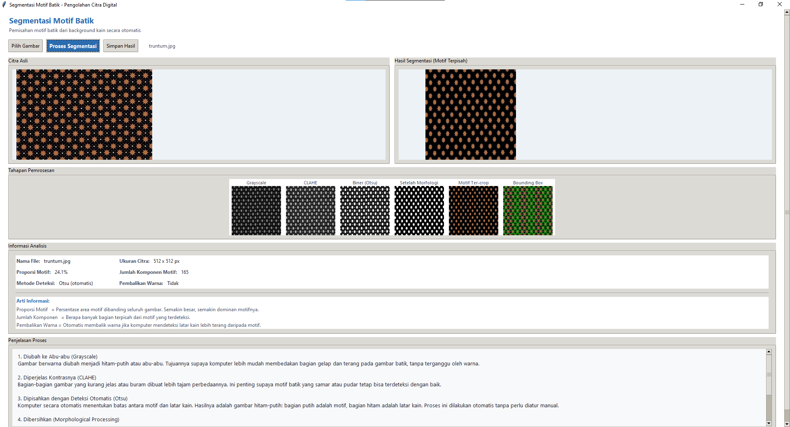

Fitur GUI:
- Pilih gambar batik melalui dialog file
- Lihat perbandingan citra asli dan hasil segmentasi berdampingan
- Lihat setiap tahap pemrosesan (grayscale, CLAHE, biner, morfologi, masking, overlay)
- Baca penjelasan setiap tahap dalam bahasa Indonesia
- Simpan hasil ke folder pilihan
- Scroll penuh pada seluruh konten window
- Dukungan path berisi Unicode (karakter Jepang, Cina, dll)

### 6. Lihat Hasil (CLI)

Hasil segmentasi akan tersimpan di folder `output/`:
- `[nama]_gray.png` — Grayscale
- `[nama]_clahe.png` — CLAHE contrast enhancement
- `[nama]_binary.png` — Otsu thresholding mentah
- `[nama]_cleaned.png` — Setelah morphological + filter komponen
- `[nama]_masked.png` — Motif yang sudah ter-crop dari background
- `[nama]_overlay.png` — Overlay bounding box pada citra asli

---

## Alur Kerja

```
Citra Batik → Grayscale → CLAHE → Otsu Thresholding
    → Auto-Invert → Morphological Opening
    → Filter Komponen → Motif Tersegmentasi
```

---

## Contoh Hasil

Berikut contoh hasil segmentasi pada beberapa motif batik dari dataset:

| Motif | Citra Asli | Motif Ter-crop | Overlay |
|-------|-----------|----------------|---------|
| Parang | 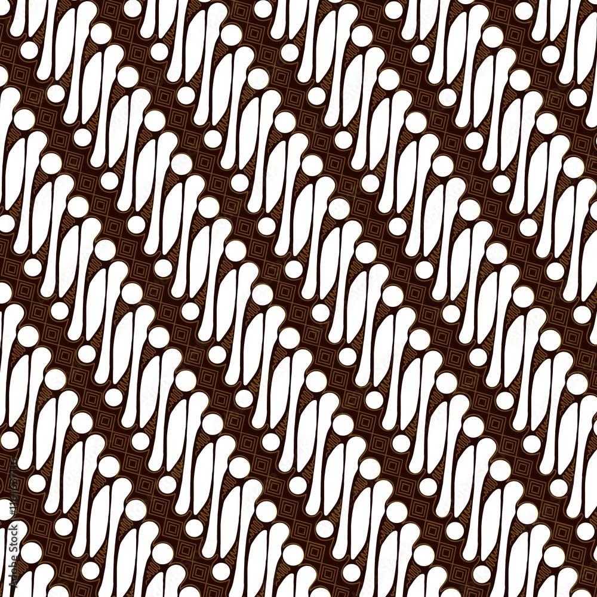 | 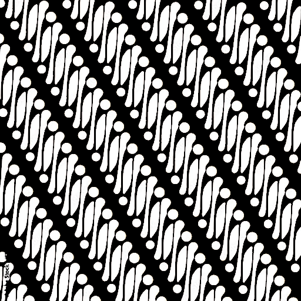 | 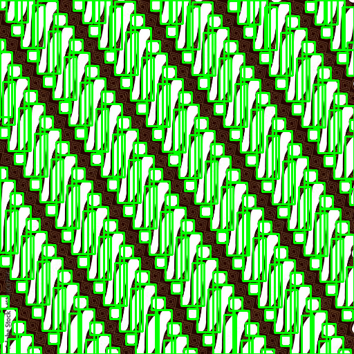 |
| Kawung | 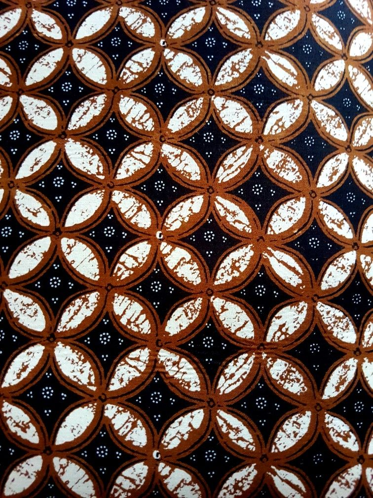 | 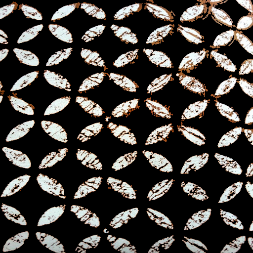 | 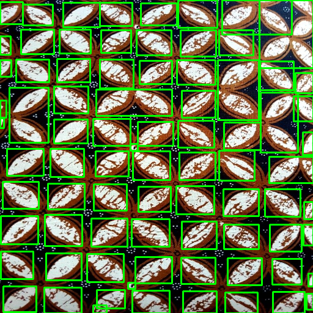 |
| Mega Mendung | 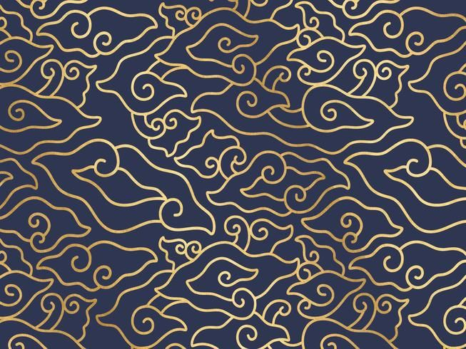 | 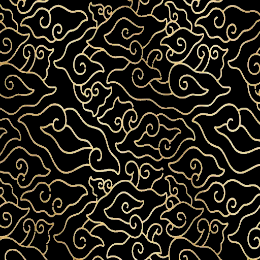 | 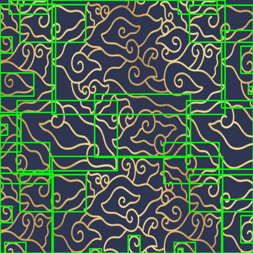 |
| Ceplok | 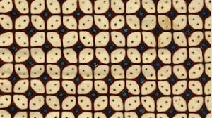 | 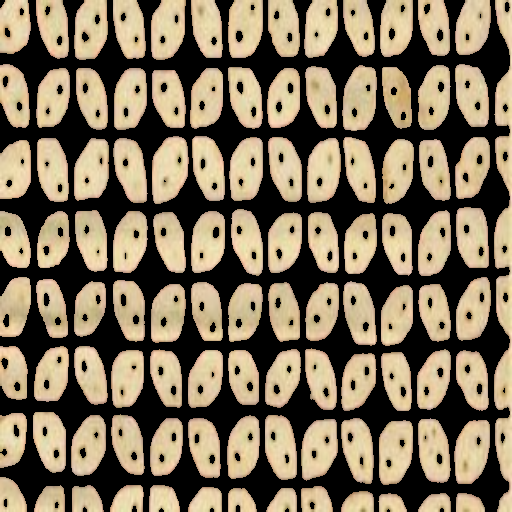 | 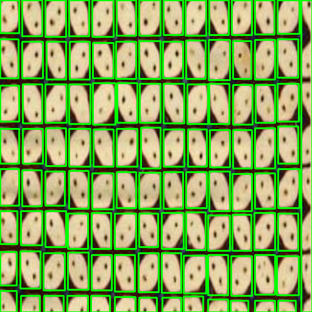 |

### Tahapan pemrosesan pada satu contoh (Parang)

| Grayscale | CLAHE | Biner (Otsu) | Setelah Morfologi | Motif Ter-crop | Overlay |
|-----------|-------|-------------|-------------------|----------------|---------|
| 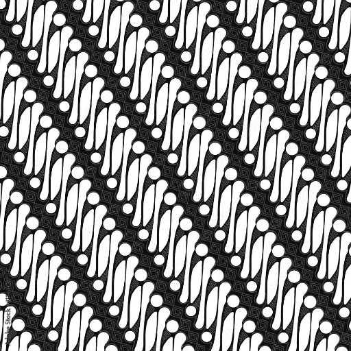 | 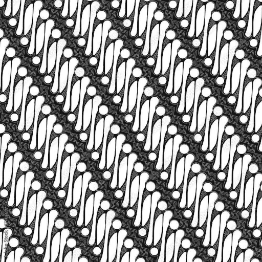 | 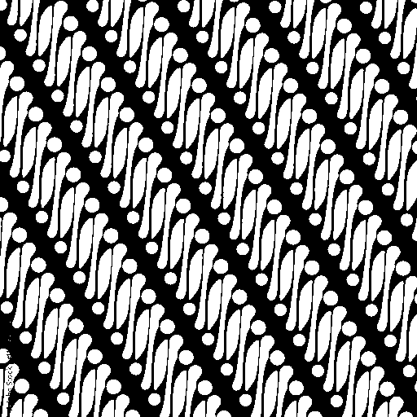 | 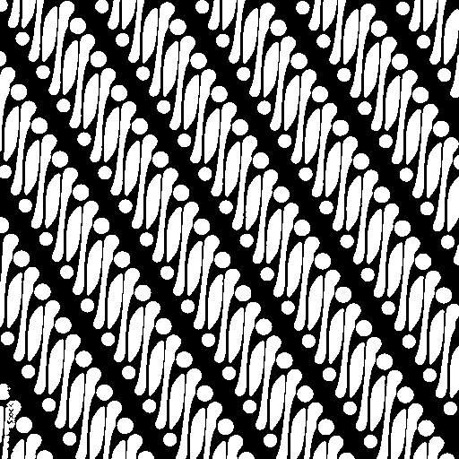 |  |  |

---

## Dependencies

| Package | Versi | Fungsi |
|---------|-------|--------|
| opencv-python | ≥4.8.0 | Operasi citra digital |
| numpy | ≥1.24.0 | Manipulasi array/matriks |
| Pillow | ≥9.0.0 | Tampilan gambar di GUI |

---

## License

Project ini dibuat untuk tujuan akademis.
